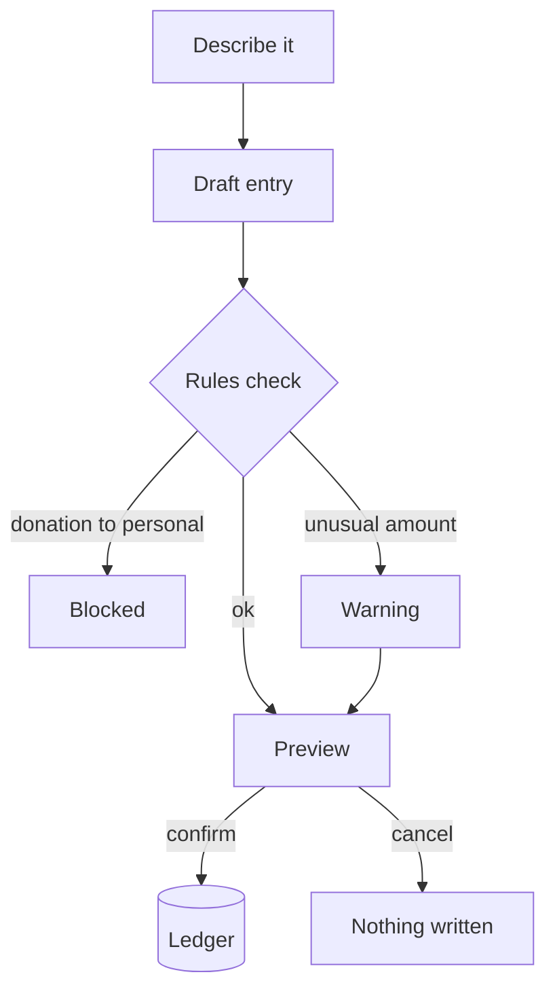

<b>A finance desk you talk to, built to stop donation money being misfiled</b>

أمين — سجلّ مالي بالمحادثة، يمنع قيد أموال التبرعات في غير بندها

<b>Status:</b> Internal pilot &nbsp;·&nbsp; <b>Built by</b> <a href="https://github.com/Mohanad1st">Mohannad Hesham</a>

> Case study only: the source is private because it holds real financial records. Walkthrough on request.

## The problem

Small organisations often track day-to-day money by hand, and when donations, operating costs and staff reimbursements pass through the same few people, one miscategorised line is the kind of mistake that erodes trust. Ameen is a single-user internal pilot that puts a conversational front end on a working ledger, with rules that block the costliest miscategorisation instead of just warning about it. It supports bookkeeping; it does not replace the accountant or the audit.

## What it does

- Ask about balances and recent transactions in plain language
- Describe a transaction in a sentence; Ameen turns it into a structured entry and shows a preview
- Track receivables and payables and reconcile them as they are paid
- Multi-currency entries with a combined estimate across currencies

## See it

How the work flows:

Screens are not shown because every screen in this app displays real financial records.

## Built with

Next.js · TypeScript · Tailwind CSS · a spreadsheet-backed ledger · an LLM for understanding plain-language entries

## Built responsibly

- Nothing is written without an explicit confirm; the assistant can only prepare a preview
- Append-only through the app: it can add entries but has no edit or delete path
- Rule-based guardrails block donation or grant money from being recorded as personal funds
- Every entry is timestamped
- The app sits behind an access code; it is a single-user pilot, not yet a multi-user system

## What it deliberately doesn't do

- It does not give financial advice, and it never moves money. It records what already happened.

## More from Life From Water

- [LFW HR System](https://github.com/Mohanad1st/lfw-hr-system-showcase) — Attendance, leave, overtime and approvals for a field NGO, in Arabic and English
- [WaterEye](https://github.com/Mohanad1st/watereye-showcase) — Read an analogue water gauge from a phone photo, no smart meter needed
- [Life From Water — donation platform](https://github.com/Mohanad1st/lifefromwater-website-showcase) — Donations and impact you can check, for a water-access NGO in rural Egypt
- [Opportunity Studio](https://github.com/Mohanad1st/opportunity-studio-showcase) — An evidence-first pipeline for grants, fellowships and tenders

---

© 2026 Mohannad Hesham. Showcase text and images only — no source code is published or licensed here. See all my work on <a href="https://github.com/Mohanad1st">my GitHub profile</a> · <a href="https://www.linkedin.com/in/mohannadhesham/">LinkedIn</a>.
