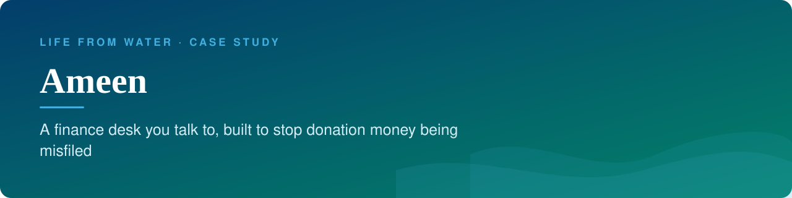
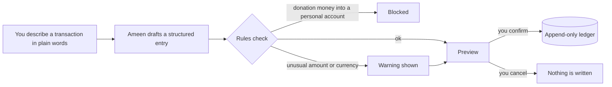

<b>Status:</b> Internal pilot &nbsp;·&nbsp; <b>Built by</b> <a href="https://github.com/Mohanad1st">Mohannad Hesham</a> &nbsp;·&nbsp; <b>Source:</b> private

> **This is a showcase, not the code.** The source is private because it holds real financial records. This page shows what it does and how it was built, not the code itself. A live walkthrough is available on request.

## The problem

In a small NGO, the founder often keeps the books by hand. Donation money, personal money, what others owe and what the organisation owes all end up in one spreadsheet, and one miscategorised line is the kind of mistake that erodes trust. Ameen puts a conversational front end on that ledger, with hard rules that block the costliest mistakes instead of just warning about them.

## What it does

- Ask about balances and recent transactions in plain language
- Describe a transaction in a sentence; Ameen turns it into a structured entry and shows a preview
- Track receivables and payables and reconcile them as they are paid
- Multi-currency entries with a combined estimate across currencies

## See it

How the work flows:

Screens are not shown because every screen in this app displays real financial records.

## Built with

Next.js · TypeScript · Tailwind CSS · Google Sheets as the ledger · an LLM for understanding plain-language entries

## Built responsibly

- Nothing is written without an explicit confirm; the assistant can only prepare a preview
- The ledger is append-only, enforced on the server: entries are added, never overwritten
- Rule-based guardrails block donation or grant money from being recorded as personal funds
- Every entry is timestamped
- The whole app sits behind a login

## What it deliberately doesn't do

- It does not give financial advice, and it never moves money. It records what already happened.

## More from Life From Water

- [LFW HR System](https://github.com/Mohanad1st/lfw-hr-system-showcase) — Attendance, leave, overtime and approvals for a field NGO, in Arabic and English
- [Life From Water — donation platform](https://github.com/Mohanad1st/lifefromwater-website-showcase) — Donations and impact you can check, for a water-access NGO in rural Egypt
- [Opportunity Studio](https://github.com/Mohanad1st/opportunity-studio-showcase) — An evidence-first pipeline for grants, fellowships and tenders

---

© 2026 Mohannad Hesham. Showcase text and images only — no source code is published or licensed here. See all my work on <a href="https://github.com/Mohanad1st">my GitHub profile</a> · <a href="https://www.linkedin.com/in/mohannadhesham/">LinkedIn</a>.
