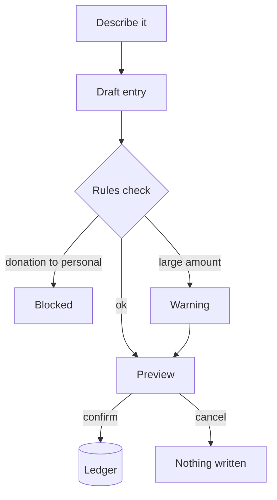

<b>A finance desk you talk to, built to stop donation money being misfiled</b>

أمين — سجلّ مالي بالمحادثة، مصمَّم لمنع قيد أموال التبرعات كأموال شخصية

<b>Status:</b> Internal pilot &nbsp;·&nbsp; <b>Built by</b> <a href="https://github.com/Mohanad1st">Mohannad Hesham</a>

> This is a case study. The source is private because it is wired to real financial records.

## Why I built it

I was tracking donations, receivables and payables by hand in a spreadsheet. When donation money and personal money pass through the same hands, one miscategorised line is the kind of mistake that erodes trust. So I built Ameen: a conversational front end on that ledger, with rules that block donation money being recorded as personal funds instead of just warning.

## What it does

- Ask about balances and recent transactions in plain language.
- Describe a transaction in a sentence. Ameen turns it into a structured entry and shows a preview.
- Track receivables and payables, and reconcile them as they're paid.
- Multi-currency entries, with a combined estimate across currencies.

## How it works

Screens aren&#x27;t shown because every screen displays real financial records.

## What it's built on

Next.js · TypeScript · Tailwind CSS · a spreadsheet-backed ledger · an LLM that reads plain-language entries

## Safeguards

- Nothing is written without an explicit confirm. The assistant can only prepare a preview.
- Append-only through the app. It can add entries; it has no edit or delete path.
- Rules block donation or grant money from being recorded into a known personal account.
- Every entry is timestamped.
- It sits behind an access code. It's a single-user pilot, not a multi-user system.

## What's not solved yet

- Amounts aren't yet stored as exact decimals, and with one shared access code no entry can be traced to a person. Both need fixing before anyone else uses it.

## What it doesn't do

- It never moves money. It records what already happened.

## More from Life From Water

- [LFW HR System](https://github.com/Mohanad1st/lfw-hr-system-showcase) — Attendance, leave, overtime and approvals for our field staff, in Arabic and English
- [WaterEye](https://github.com/Mohanad1st/watereye-showcase) — Read an analogue pressure or flow gauge from a photo, with no smart meter
- [Life From Water: donation platform](https://github.com/Mohanad1st/lifefromwater-website-showcase) — A donation platform in the making, with impact you can check, for our water-access work in rural Egypt
- [Opportunity Studio](https://github.com/Mohanad1st/opportunity-studio-showcase) — An evidence-first pipeline for grants, fellowships and tenders

---

© 2026 Mohannad Hesham. Showcase text and images only — no source code is published or licensed here. See all my work on <a href="https://github.com/Mohanad1st">my GitHub profile</a> · <a href="https://www.linkedin.com/in/mohannadhesham/">LinkedIn</a>.
